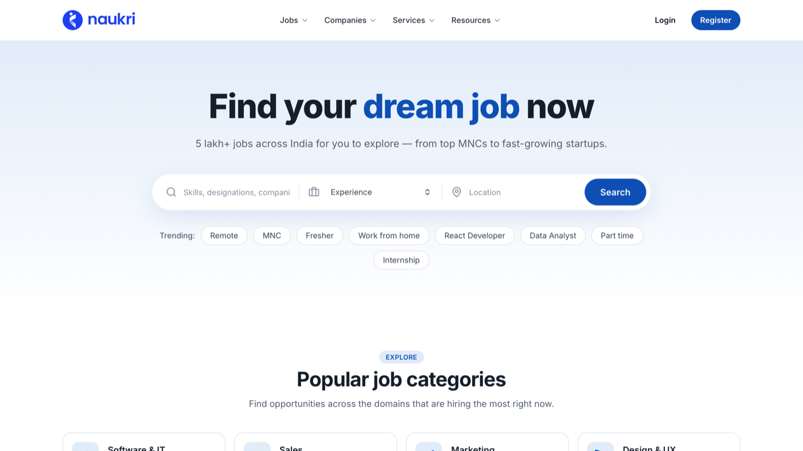

# Naukri Homepage Clone

A responsive homepage inspired by [Naukri.com](https://www.naukri.com/), built with
**React** and **Tailwind CSS**. It uses static/dummy data only — no backend or API.

Built as a frontend assignment to demonstrate component design, responsiveness,
and clean, maintainable code.

**▶ Live demo: https://chaitu116.github.io/Naukri_Clone/**



## ✨ Features

- **Fully responsive** — tested across mobile, tablet, and desktop breakpoints.
- **Reusable component architecture** — UI primitives, cards, layout, and sections
  are cleanly separated and data-driven.
- **All required homepage sections**:
  1. Header / Navbar (with responsive mobile menu)
  2. Hero section with a multi-field search bar
  3. Popular job categories
  4. Featured jobs
  5. Top hiring companies
  6. Featured companies
  7. Testimonials / success stories (with a platform-stats band)
  8. App promotion / call-to-action
  9. Footer
- **Dummy data in separate files** under `src/data/`.
- Subtle hover effects and transitions for a smooth experience.

## 🛠 Tech Stack

| Purpose       | Library              |
| ------------- | -------------------- |
| UI framework  | React 19             |
| Build tool    | Vite 8               |
| Styling       | Tailwind CSS 4       |
| Routing       | react-router-dom 7   |
| Icons         | lucide-react         |

## 🚀 Getting Started

### Prerequisites

- Node.js 18+ and npm

### Setup

```bash
# 1. Install dependencies
npm install

# 2. Start the dev server (http://localhost:5173)
npm run dev

# 3. Create a production build
npm run build

# 4. Preview the production build locally
npm run preview

# Lint the project
npm run lint
```

## 📁 Project Structure

```
src/
├── assets/                 # Logo + app-promo image
├── data/                   # Static/dummy data (separated by domain)
│   ├── categories.js
│   ├── jobs.js
│   ├── companies.js
│   ├── featuredCompanies.js
│   └── testimonials.js
├── components/
│   ├── ui/                 # Reusable primitives
│   │   ├── Container.jsx
│   │   ├── Button.jsx
│   │   ├── SectionHeading.jsx
│   │   ├── Badge.jsx
│   │   ├── Rating.jsx
│   │   └── Logo.jsx        # Logo with monogram fallback
│   ├── cards/              # Reusable card components
│   │   ├── JobCard.jsx
│   │   ├── CompanyCard.jsx
│   │   ├── CategoryCard.jsx
│   │   ├── FeaturedCompanyCard.jsx
│   │   └── TestimonialCard.jsx
│   ├── layout/             # Navbar + Footer
│   └── sections/           # Page sections (Hero, FeaturedJobs, …)
├── pages/
│   └── Home.jsx            # Composes layout + all sections
├── App.jsx                 # Routes
├── main.jsx                # Entry point
└── index.css               # Tailwind import + design tokens
```

## 🎨 Design Notes

- A small set of **design tokens** (brand blue, ink, muted, font) is defined in
  `src/index.css` via Tailwind's `@theme`, so the palette stays consistent.
- Company logos load from [Clearbit's logo API](https://clearbit.com/logo); the
  `Logo` component falls back to a tinted monogram if a logo fails to load, so
  cards never show a broken image.
- Avatars and the phone mockup use public placeholder services
  (`pravatar.cc`, bundled image asset).

## 📦 Build Output

`npm run build` produces a static bundle in `dist/`, deployable to any static
host (Vercel, Netlify, GitHub Pages, etc.).

This repo deploys itself to GitHub Pages on every push to `main` via
[`.github/workflows/deploy.yml`](.github/workflows/deploy.yml). Because Pages
serves it from the `/Naukri_Clone/` subpath, `vite.config.js` sets `base` and
`main.jsx` passes `basename` to `BrowserRouter` — both are needed for routing
and assets to resolve there.
